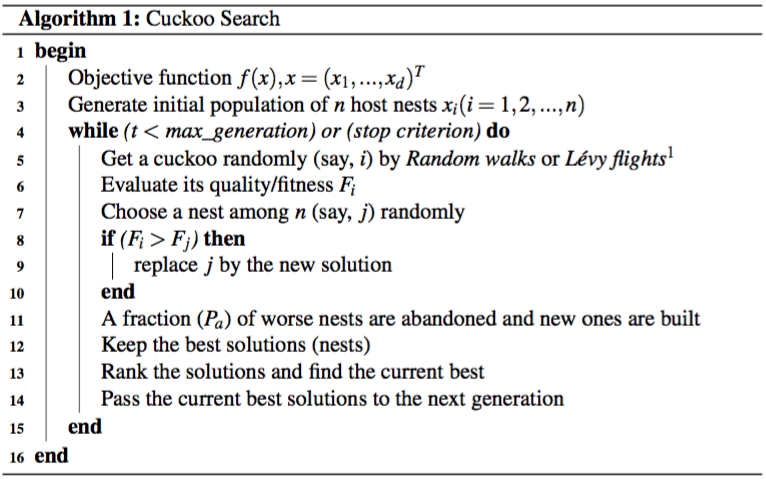

## School of Computer Sciences, Universiti Sains Malaysia
### CCS524 Parallel Computing Architectures and Algorithms
### Semester 1, 2015/2016
### Metaheuristic **Cuckoo Search** - Sequential Implementation (Baseline)
### Algorithm:

### Solve the Traveling Salesman Problem:
TSP - a classic combinatorial optimization problem in computer science and operational research. Described as: given a list of cities, find the shortest route to visit each city once. A computationally hard to solve due to *O(n!)* algorithm complexity if use the exhausitve-search/brute-force approach, making it a Nondeterministic Polynomial-time (NP)-hard problem. For instance, a 30-cities TSP has approx. 265 nonillions or 265, 252, 859, 812, 191, 058, 636, 308, 480, 000, 000 of possible permutations.

Given that TSP is NP-hard, therefore polynomial-time algorithms to solve the TSP with optimal solution are unlikely to exist. Thus, the focus has been shifted to the more efficient approximation algorithms that offer fast computation time and near-optimal solutions.

There are two types of TSP, *asymmetric* and *symmetric*. The symmetric TSP is where the distance between two cities in the route is same in both directions; in asymmetric TSP the distances might be different or paths may not exist in both directions. TSP can be modeled as a weighted graph and denoted in graph notation as follows:

* Let *G = (V, E)* be a weighted graph where,
* *V* is a set of *m* vertices (cities), *V* = {*v1*, ..., *vm*}
* *E* is a set of *n* edges (paths), *E* = {(*i*, *j*) :*i*, *j* ∈ *V*}

Here, *E* represents the distance matrix, *D* = (*d*i,j) and if *d*i,j = *d*j,i then it is an undirected graph and a symmetric TSP; whereas if *d*i,j != *d*j,i then it is a directed graph and asymmetric TSP.

**Perturbation/permutation:** Random walk

**Dataset:** [TSPLIB][1] (eil51, pr124, rat575, pr1002, fnl4461)

### Compile, run, clean:

    $ make
    $ ./Seq-CSTSP tsplib/fnl4461.tsp
    $ make clean

### Change the algorithm parameters in `CS.h` header file:

     #define MAX_GENERATION  10000    /* stop criterion: maximum generation of cuckoo with better fitness */
     #define N_NEST             80    /* population size: a fixed number of nests */
     #define PA               0.25    /* portion of bad solutions: cuckoo's egg probability discovered by host bird */
     #define RWALK_RSTEP         0    /* random_walk in random step */
     #define RWALK_MAX_ITER   1000    /* max iter before give up (RWALK_FITTER) */
     #define RWALK_FITTER        1    /* new random walk output need to be fitter */
     #define RWALK_NFITTER       0    /* need not fitter */
     

### References
--------------
1. X. S. Yang and S. Deb, “Cuckoo search via Lévy flights,” 2009 World Congress on Nature and Biologically Inspired Computing, NABIC 2009 - Proceedings, pp. 210-214, 2009.

1. N. Bacanin. An object-oriented software implementation of a novel cuckoo search algorithm Faculty of Computer Science. Computing, pages 245-250.

1. R. Jovanovic, M. Tuba, and I. Brajevic. Parallelization of the cuckoo search using cuda architecture. In Proceedings of the 7th International Conference on Applied Mathematics, Simulation, Modelling, Recent Advances in Mathematics, ASM13. WSEAS Press, 2013.

1. Azizah Mohamad, Azlan Mohd Zain, Nor Erne Nazira Bazin, and Amirmudin Udin. Cuckoo Search Algorithm for Optimization Problems - A Literature Review. Applied Mechanics and Materials, 421(September 2015):502-506, 2013.

1. A. Ouaarab, B. Ahiod, and X. S. Yang. Improved and discrete cuckoo search for solving the travelling salesman problem. In X. S. Yang, editor, Cuckoo Search and Firefly Algorithm, volume 516 of Studies in Computational Intelligence, pages 63-84. Springer International Publishing, 2014.

1. X.Ouyang, Y.Zhou, Q.Luo, and H.Chen. A novel discrete cuckoo search algorithm for spherical traveling salesman problem. Applied Mathematics and Information Sciences, 7(2):777-784, 2013.

1. M. Subotic, M. Tuba, N. Bacanin, and D. Simian. Parallelized cuckoo search algorithm for unconstrained optimization. In Proceedings of the 5th WSEAS Congress on Applied Computing Conference, and Proceedings of the 1st International Conference on Biologically Inspired Computation, BICA'12, pages 151-156, Stevens Point, Wisconsin, USA, 2012. World Scientific and Engineering Academy and Society (WSEAS).

1. X. Xu, Z. Ji, F. Yuan, and X. Liu. A novel parallel approach of cuckoo search using mapreduce. In International Conference on Computer, Communications and Information Technology. Atlantis Press, January 2014.

1. X. S. Yang. Cuckoo search (cs) algorithm - file exchange - matlab central. http://www.mathworks.com/matlabcentral/fileexchange/ 29809-cuckoo-search-cs-algorithm, 2009. [Online; accessed 2015-10-5].

1. TSPLIB95 - http://www.iwr.uni-heidelberg.de/groups/comopt/software/TSPLIB95

[1]: http://www.iwr.uni-heidelberg.de/groups/comopt/software/TSPLIB95
